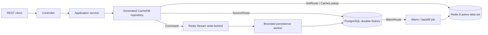

# CacheDB PostgreSQL Sample

English | [Türkçe](README.tr.md)

A production-oriented Spring Boot REST API that demonstrates CacheDB with Redis
8 and PostgreSQL. The sample is intentionally explicit: operational routes use
a bounded Redis active data set, durable history stays in PostgreSQL, and
growing lists use projections instead of full aggregates.

> This sample consumes the immutable CacheDB `0.7.1` release from GitHub
> Packages; the CacheDB source repository is not part of the sample build.

## Start Here

| Goal | Go to |
| --- | --- |
| Run the complete sample | [Quick Start](#quick-start) |
| Understand Redis vs PostgreSQL behavior | [Runtime Contract](#runtime-contract) |
| See the declarative Java API | [Code Walkthrough](#code-walkthrough) |
| Warm existing PostgreSQL rows | [Warm Existing Data](#warm-existing-data) |
| Choose cache limits | [Tuning by Use Case](#tuning-by-use-case) |
| Exercise every route | [API Catalog](#api-catalog) or [Postman](#postman) |
| Prepare a production rollout | [Production Checklist](#production-checklist) |
| Fix a startup or data-path problem | [Troubleshooting](#troubleshooting) |

## What This Sample Teaches

The domain is larger than a toy CRUD application:

- customers place orders with many order lines
- product availability serves catalog and low-stock screens
- shipments expose active, exception, event, and archive routes
- support tickets feed an operational dashboard
- report jobs and audit events separate live work from durable history

The important product boundary is equally explicit:

| Classification | Meaning |
| --- | --- |
| **BEST** | Define a bounded operational route, warm its entity or projection data, measure it, and keep archive/history reads on PostgreSQL. |
| **ACCEPTABLE** | Use an explicit bounded PostgreSQL route for infrequent data outside the Redis active set. |
| **ANTI-PATTERN** | Treat CacheDB as a transparent cache and expect every Redis miss to run an arbitrary SQL query and refill Redis automatically. |

CacheDB is a strong fit when the team knows which screens and commands require
predictable low latency. It is not a fit for applications whose main workload
is unbounded ad-hoc querying over the complete database.

## Architecture



The application code depends on repository interfaces. The annotation
processor generates implementations, codecs, indexes, projection bindings, and
Spring beans at compile time. Runtime reflection is not used for entity
discovery.

## Key Terms

| Term | Meaning in this sample |
| --- | --- |
| Entity | The command/detail model mapped to SQL columns and a Redis namespace |
| Projection | A compact, screen-specific read model such as `OrderSummary` |
| Active data set | The bounded subset intentionally available in Redis |
| Hot route | A repository method whose contract reads the Redis active data set |
| Source route | A bounded repository method that reads PostgreSQL explicitly |
| Warm/backfill | A controlled PostgreSQL-to-Redis preparation job |
| Route coverage | Evidence that the required scope/window has been prepared in Redis |
| Write-behind | An accepted Redis command that is persisted to PostgreSQL asynchronously |
| Write receipt | The command result used to track identity, version, and durability state |

## Prerequisites

- JDK 21
- Maven 3.9+
- Docker Desktop or a compatible Docker Engine
- PowerShell 7+ for the bundled load script
- a GitHub token with `read:packages` only when resolving a published package
  from GitHub Packages

Verify the local toolchain:

```powershell
java -version
mvn -version
docker version
docker compose version
```

## Dependency Model

The sample consumes CacheDB as Maven artifacts. It does not compile framework
sources as part of the sample build.

```xml
<properties>
    <java.version>21</java.version>
    <cachedb.version>0.7.1</cachedb.version>
</properties>

<dependencyManagement>
    <dependencies>
        <dependency>
            <groupId>com.reactor.cachedb</groupId>
            <artifactId>cachedb-bom</artifactId>
            <version>${cachedb.version}</version>
            <type>pom</type>
            <scope>import</scope>
        </dependency>
    </dependencies>
</dependencyManagement>

<dependencies>
    <dependency>
        <groupId>com.reactor.cachedb</groupId>
        <artifactId>cachedb-spring-boot-starter-postgres</artifactId>
    </dependency>
    <dependency>
        <groupId>com.reactor.cachedb</groupId>
        <artifactId>cachedb-annotations</artifactId>
    </dependency>
    <dependency>
        <groupId>org.springframework.boot</groupId>
        <artifactId>spring-boot-starter-jdbc</artifactId>
    </dependency>
    <dependency>
        <groupId>org.postgresql</groupId>
        <artifactId>postgresql</artifactId>
        <scope>runtime</scope>
    </dependency>
</dependencies>

<build>
    <plugins>
        <plugin>
            <artifactId>maven-compiler-plugin</artifactId>
            <configuration>
                <release>${java.version}</release>
                <annotationProcessorPaths>
                    <path>
                        <groupId>com.reactor.cachedb</groupId>
                        <artifactId>cachedb-processor</artifactId>
                        <version>${cachedb.version}</version>
                    </path>
                </annotationProcessorPaths>
            </configuration>
        </plugin>
    </plugins>
</build>
```

Add `cachedb-spring-boot-starter-admin` only when the operations UI is needed.
If JPA or another starter already creates the application `DataSource`, adding
`spring-boot-starter-jdbc` again is not required. CacheDB needs one working
`DataSource`, one provider starter, the annotations artifact, and the annotation
processor.

The sample POM declares GitHub Packages twice because Maven resolves normal
dependencies and build plugins from separate repository lists:

```xml
<repositories>
    <repository>
        <id>cache-database-github-packages</id>
        <url>https://maven.pkg.github.com/esasmer-dou/cache-database</url>
    </repository>
</repositories>

<pluginRepositories>
    <pluginRepository>
        <id>cache-database-github-packages</id>
        <url>https://maven.pkg.github.com/esasmer-dou/cache-database</url>
        <releases><enabled>true</enabled></releases>
        <snapshots><enabled>false</enabled></snapshots>
    </pluginRepository>
</pluginRepositories>
```

`repositories` resolves the BOM, starters, and libraries.
`pluginRepositories` resolves `cachedb-maven-plugin:doctor`. The repository
ID in both POM sections and the server ID in Maven `settings.xml` must match:

```xml
<settings>
    <servers>
        <server>
            <id>cache-database-github-packages</id>
            <username>${env.GITHUB_ACTOR}</username>
            <password>${env.GITHUB_TOKEN}</password>
        </server>
    </servers>
</settings>
```

## Quick Start

### 1. Verify published package access

Configure `GITHUB_ACTOR`, a `read:packages` token, and the matching Maven
server entry shown above. Then prove that dependencies and the build plugin are
resolved without the CacheDB source repository:

```powershell
mvn -U -DskipTests validate
```

The build must print `CacheDB doctor` and `OK: CacheDB build contract is
consistent`. Install framework sources locally only when intentionally testing
an unreleased framework change.

### 2. Start Redis and PostgreSQL

```powershell
docker compose up -d
docker compose ps
```

The compose file starts:

| Service | Address | Local purpose |
| --- | --- | --- |
| Redis 8.2.1 | `127.0.0.1:56379` | Active entities, projections, indexes, streams, leases, and telemetry |
| PostgreSQL 16 | `127.0.0.1:55432` | Durable source of truth |

### 3. Start the API in the demo profile

The `demo` profile is required for local schema initialization, seed endpoints,
warm endpoints, scheduled warm, and the admin UI.

```powershell
$env:SPRING_PROFILES_ACTIVE = "demo"
mvn spring-boot:run
```

Bash equivalent:

```bash
SPRING_PROFILES_ACTIVE=demo mvn spring-boot:run
```

### 4. Verify readiness

```powershell
Invoke-RestMethod http://127.0.0.1:8091/actuator/health/readiness
```

Continue only when the status is `UP`. Readiness covers Redis, PostgreSQL, and
write-behind health; liveness only proves that the process is running.

### 5. Seed durable demo data

Seed runs as a bounded distributed job and returns `202 Accepted`. Poll the job
instead of keeping one HTTP request open:

```powershell
$seed = Invoke-RestMethod -Method Post `
  -Uri "http://127.0.0.1:8091/api/demo/seed?customers=20&ordersPerCustomer=40&linesPerOrder=4"

do {
    Start-Sleep -Milliseconds 250
    $seedState = Invoke-RestMethod "http://127.0.0.1:8091/api/warm/jobs/$($seed.jobId)"
} while ($seedState.status -in @("QUEUED", "RUNNING"))

if ($seedState.status -ne "COMPLETED") {
    throw ($seedState | ConvertTo-Json -Depth 8)
}
```

`COMPLETED` means the seed job finished. Before a production cutover, also
observe readiness and the write-behind backlog until SQL durability is healthy.

Seed creates durable demo rows, but it does not declare every Redis route
complete. A hot list intentionally returns `503 Service Unavailable` until its
matching warm job finishes and coverage is recorded. This prevents an empty or
partial Redis window from being mistaken for a complete business result.

### 6. Warm the customer timeline projection

```powershell
$warm = Invoke-RestMethod -Method Post `
  -Uri "http://127.0.0.1:8091/api/warm/orders/customer/1?limit=100&projectionOnly=true"

do {
    Start-Sleep -Milliseconds 250
    $warmState = Invoke-RestMethod "http://127.0.0.1:8091/api/warm/jobs/$($warm.jobId)"
} while ($warmState.status -in @("QUEUED", "RUNNING"))

if ($warmState.status -ne "COMPLETED") {
    throw ($warmState | ConvertTo-Json -Depth 8)
}
```

### 7. Compare the active route with the archive route

```powershell
# Redis projection route
Invoke-RestMethod "http://127.0.0.1:8091/api/customers/1/orders?limit=10"

# Bounded PostgreSQL route
Invoke-RestMethod "http://127.0.0.1:8091/api/orders/archive?customerId=1&limit=10"
```

### 8. Open the tools

- Admin UI: `http://127.0.0.1:8091/cachedb-admin`
- Tuning snapshot: `http://127.0.0.1:8091/api/tuning`
- Scheduled warm status: `http://127.0.0.1:8091/api/warm/schedules`

Stop the local infrastructure without deleting PostgreSQL data:

```powershell
docker compose down
```

Use `docker compose down -v` only when the local PostgreSQL volume should be
deleted intentionally.

## Runtime Contract

| Operation | Primary path | If data is outside Redis | Durability / safety rule |
| --- | --- | --- | --- |
| `save`, update, soft delete | Redis first, then PostgreSQL write-behind | The command can enter Redis when admission policy permits | `202 Accepted` is not the same as SQL commit; inspect the receipt and readiness telemetry |
| Entity detail | Redis entity lookup | Returns an explicit unavailable/not-found outcome; it does not run arbitrary SQL automatically | Warm the entity route or expose a bounded source-detail route |
| Growing list or dashboard | Redis projection | `completeItems()` returns `503 Service Unavailable` until the exact route scope is warm and complete | Warm the matching route, poll the job to `COMPLETED`, and require coverage before cutover |
| Archive, export, audit history | Bounded PostgreSQL source route | Reads PostgreSQL directly | Apply row limits, deterministic ordering, indexes, and timeouts |
| Existing PostgreSQL rows | Warm/backfill reads PostgreSQL and hydrates Redis | No automatic startup import | Dry-run first, run a bounded warm job, then verify coverage |
| External PostgreSQL write | PostgreSQL changes first | Redis can become stale without a feed | Integrate outbox/CDC; periodic warm is reconciliation, not a replacement for event propagation |

The active data set is a deliberate subset, not a second complete copy of the
database. Redis memory must be budgeted for entity payloads, projections,
indexes, stream state, leases, and operational metadata.

## Code Walkthrough

### 1. Entity: persistence shape

[`OrderEntity`](src/main/java/com/example/cachedb/sample/domain/OrderEntity.java)
maps SQL columns, Redis namespace, a partitioned index, and a bounded relation:

```java
@CacheEntity(table = "sample_orders", redisNamespace = "sample-orders")
@CachePartitionedIndex(partitionBy = "customer_id", sortBy = "order_date")
public class OrderEntity {
    @CacheId(column = "order_id")
    public Long orderId;

    @CacheColumn("customer_id")
    public Long customerId;

    @CacheColumn("order_date")
    public Long orderDate;

    @CacheRelation(
            target = OrderLineEntity.class,
            mappedBy = "orderId",
            kind = CacheRelation.RelationKind.ONE_TO_MANY,
            batchLoadOnly = true,
            maxRowsPerParent = 50,
            parentBatchSize = 16,
            orderBy = "lineNumber ASC"
    )
    public List<OrderLineEntity> lines;
}
```

The database foreign key protects durable relational integrity.
`@CacheRelation` tells CacheDB how to load and bound the relation. Either can
exist without the other, but production models normally need both.

### 2. Projection: screen shape

[`OrderSummary`](src/main/java/com/example/cachedb/sample/readmodel/OrderSummary.java)
is smaller than `OrderEntity` and excludes order-line payloads:

```java
@CacheProjectionRecord(
        source = OrderEntity.class,
        id = "orderId",
        name = "order-summary",
        rankedBy = {"order_date", "priority_score"},
        refresh = CacheProjectionRecord.Refresh.ASYNC
)
public record OrderSummary(
        Long orderId,
        Long customerId,
        Long orderDate,
        BigDecimal orderAmount,
        String currencyCode,
        String orderType,
        String status,
        Integer lineCount,
        Double priorityScore
) {
}
```

Use an entity for commands and selected detail. Use a projection for a list,
timeline, dashboard, top-N, or global sorted route.

### 3. Repository: route contract

[`OrderRepository`](src/main/java/com/example/cachedb/sample/repository/OrderRepository.java)
declares the route; the processor generates its implementation:

```java
@CacheRepository(entity = OrderEntity.class)
public interface OrderRepository extends CacheDbRepository<OrderEntity, Long> {

    @HotRoute(
            value = "customer-order-timeline",
            projection = OrderSummary.class,
            pageSize = 100,
            hotWindow = 1_000,
            memoryBudgetBytes = 16_777_216L,
            coverageScopeParameter = "customerId"
    )
    @CacheRouteQuery(
            predicates = @CachePredicate(field = "customerId", parameter = "customerId"),
            orderBy = {
                    @CacheOrder(field = "orderDate", direction = CacheOrder.Direction.DESC),
                    @CacheOrder(field = "orderId", direction = CacheOrder.Direction.DESC)
            },
            windowParameter = "window"
    )
    HotWindow<OrderSummary> customerTimeline(long customerId, WindowRequest window);

    @WarmRoute(
            value = "warm-customer-order-timeline-projection",
            from = "customerTimeline",
            maxRows = 1_000,
            maxRowsParameter = "maxRows",
            coverageScopeParameter = "customerId",
            projectionsOnly = true
    )
    CacheWarmPlan warmCustomerTimelineProjection(long customerId, int maxRows);
}
```

The route contract puts the page size, active window, memory budget, sort order,
coverage scope, and warm limit in one reviewable place.

### 4. Application service: business orchestration

[`CustomerApplicationService`](src/main/java/com/example/cachedb/sample/application/customer/CustomerApplicationService.java)
injects interfaces, not Redis clients or generated binding classes:

```java
@Service
public final class CustomerApplicationService {
    private final CustomerRepository customers;
    private final OrderRepository orders;

    public CustomerEntity detail(long customerId, int orderPreview) {
        return SampleHotLookups.require(
                "Customer",
                customerId,
                customers.detail(customerId, orderPreview)
        );
    }

    public List<OrderSummary> orderTimeline(long customerId, int limit) {
        return orders.customerTimeline(customerId, WindowRequest.first(limit)).completeItems();
    }
}
```

Controllers validate HTTP input. Application services own use-case
orchestration. Repository interfaces own data-path contracts. Generated code
owns serialization, indexes, and provider wiring.

## Warm Existing Data

Existing PostgreSQL rows are not imported at startup. Use this sequence for an
existing system:

1. Define one bounded `@HotRoute` or `@CacheLookup`.
2. Add the matching `@WarmRoute`.
3. Run `dryRun=true` and inspect the candidate row count.
4. Submit the real warm job and poll it to `COMPLETED`.
5. Verify route coverage and compare membership/order with PostgreSQL.
6. Enable traffic gradually and retain the PostgreSQL rollback path.

Dry-run example:

```powershell
Invoke-RestMethod -Method Post `
  -Uri "http://127.0.0.1:8091/api/warm/orders/customer/1?limit=100&projectionOnly=true&dryRun=true"
```

Projection-only warm is best for lists and dashboards. Entity warm is justified
only when selected detail or command routes need the complete active payload.

For legacy tables, an `entity_version` value of `NULL` or `0` is normalized to
the initial Redis version during the first warm. This is a migration aid, not a
change-feed strategy. After cutover, every external PostgreSQL writer must
advance a monotonic version and publish through outbox/CDC, or the next bounded
reconciliation cycle must be an explicitly accepted lag window.

### Periodic warm and reconciliation

[`SampleScheduledWarmPlans`](src/main/java/com/example/cachedb/sample/config/SampleScheduledWarmPlans.java)
declares a 90-day order window. Redis leases ensure that only one pod performs a
scheduled cycle while other pods wait or skip safely. Reconciliation removes
rows that no longer satisfy the policy.

```java
@CacheScheduledWarm(
        name = "sample-active-order-window",
        fixedDelayString = "${sample.scheduled-warm.orders.fixed-delay:PT15M}",
        lockAtMostForString = "${sample.scheduled-warm.orders.lock-at-most-for:PT2M}",
        lockWaitTimeoutString = "${sample.scheduled-warm.orders.lock-wait-timeout:PT20S}",
        minimumIntervalString = "${sample.scheduled-warm.orders.minimum-interval:PT15M}",
        reconcileHotSet = true
)
public CacheWarmPlan activeOrderWindow() {
    long cutoff = Instant.now().minus(Duration.ofDays(90)).getEpochSecond();
    return orders.warmActiveWindow(cutoff, orderWarmMaxRows);
}
```

Scheduled warm maintains the chosen active window. New CacheDB writes still
enter through the normal command path immediately; they do not wait for the
next schedule.

The annotation processor validates the method and generates a typed Spring
task adapter. The runtime does not scan annotated methods or invoke them through
reflection.

## Tuning by Use Case

Start from measured route demand, not from a guess about table size.

| Scenario | Active data policy | Read model | Initial limits | Outside the active set |
| --- | --- | --- | --- | --- |
| Customer order timeline | Last 90 days **or** active order states | `OrderSummary` per customer | Page `100`, window `1,000`, route budget `16 MiB` | Bounded `archive` source route |
| Product catalog | Active products **or** in-stock/low-stock states | `ProductAvailability` | Entity limit `25,000`, page `100` | Inactive-product source route |
| Support operations | Updated in 30 days **or** `OPEN/PENDING/ESCALATED` | Entity for small rows | Entity limit `50,000`, page `50` | Explicit ticket-history SQL route when needed |
| Logistics control tower | Updated in 14 days **or** active/exception states | `ShipmentSummary` | Entity limit `150,000`, route windows `2,000-10,000` | Delivered-shipment source route |
| Report execution | `QUEUED/RUNNING/FAILED` or last 24 hours | Small job entity | Entity limit `5,000`, page `50` | Completed report history on PostgreSQL |
| Security audit | Severe events from the last 24 hours | Small bounded entity list | Entity limit `2,000`, read admission disabled | Full audit archive on PostgreSQL |

The sample exposes the resolved runtime configuration:

```powershell
Invoke-RestMethod http://127.0.0.1:8091/api/tuning
Invoke-RestMethod http://127.0.0.1:8091/api/tuning/profiles
```

Key controls in
[`SampleCacheDbTuningConfig`](src/main/java/com/example/cachedb/sample/config/SampleCacheDbTuningConfig.java):

| Control | Sample value | Why it exists |
| --- | ---: | --- |
| `maxEntityQueryLimit` | `250` | Stops broad entity materialization |
| `maxProjectionQueryLimit` | `1,000` | Allows larger compact read-model windows |
| `maxQueryLoadRows` | `1,000` | Bounds registered source loading |
| `queryTimeoutSeconds` | `15` | Bounds source reads |
| `workerThreads` | `2` | Limits concurrent SQL flush pressure |
| `batchSize` / `maxFlushBatchSize` | `128` | Reduces SQL round trips without unbounded batches |
| Redis warning / critical thresholds | `75%` / `88%` | Adds backpressure before Redis reaches maxmemory |
| expected eviction policy | `noeviction` | Prevents Redis from silently dropping coordination or write state |

Do not copy these numbers directly to production. Measure serialized payload
size, projection/index overhead, peak route concurrency, SQL flush latency, and
the Redis memory headroom needed during rewarm or failover.

## API Catalog

| Area | Representative endpoints | Data path |
| --- | --- | --- |
| Health and operations | `GET /actuator/health/readiness`, `GET /api/tuning`, `GET /api/warm/schedules` | Runtime telemetry |
| Demo setup | `POST /api/demo/seed`, `GET /api/warm/jobs/{jobId}` | Distributed background jobs |
| Customers | `POST /api/customers`, `GET /api/customers/{id}`, `GET /api/customers/{id}/orders` | Command, entity detail, projection timeline |
| Orders | `POST /api/orders`, `PATCH /api/orders/{id}/status`, `DELETE /api/orders/{id}` | Redis-first write-behind commands |
| Order reads | `GET /api/orders/{id}`, `GET /api/orders/high-value`, `GET /api/orders/archive` | Entity, ranked projection, PostgreSQL source route |
| Products | `GET /api/products/active`, `GET /api/products/low-stock`, `PATCH /api/products/{id}/stock` | Projection reads and command |
| Shipments | `GET /api/shipments/active`, `GET /api/shipments/exceptions`, `GET /api/shipments/archive` | Projection and PostgreSQL source routes |
| Support | `GET /api/tickets/open`, `POST /api/tickets`, `PATCH /api/tickets/{id}/status` | Bounded entity read and commands |
| Reporting | `GET /api/reports/jobs/live`, `GET /api/reports/audit/security`, `GET /api/reports/audit/archive` | Active rows and durable archive |
| Dashboards | `GET /api/dashboard/commerce`, `GET /api/dashboard/operations` | Pre-shaped Redis data |
| Warm | `POST /api/warm/customers/active`, `/orders/customer/{id}`, `/orders/{id}/lines`, `/orders/high-value`, `/orders/highlighted`, `/products/active`, `/products/low-stock`, `/tickets/open`, `/shipments/active`, `/shipments/customer/{id}`, `/shipments/exceptions`, `/shipments/{id}/events`, `/reports/live`, `/reports/type/{type}`, `/audit/security` | Bounded PostgreSQL-to-Redis jobs; poll `/api/warm/jobs/{jobId}` after every submission |

Request limits are validated. Oversized values return `400 Bad Request` rather
than being silently clamped. Queue saturation returns `429 Too Many Requests`.
Optimistic conflicts and not-yet-durable parent references return `409 Conflict`.

## Postman

Import:

```text
postman/cache-database-postgresql-sample.postman_collection.json
```

Run folders in this order:

1. Run readiness, submit demo seed, and repeat `Latest Background Job Status`
   until it reports `COMPLETED`.
2. In each business folder, run the matching `Warm ...` request before its hot
   list request.
3. After every `202 Accepted`, repeat `Latest Background Job Status` until the
   submitted job reports `COMPLETED`.
4. Call the hot route and compare it with the bounded archive/source route where
   the folder provides one.
5. Run the dashboard folder only after its component routes have been warmed.
6. Inspect tuning and scheduled-warm status before changing any window or pool.

## Load Test

After seed and warm complete:

```powershell
powershell -ExecutionPolicy Bypass -File .\scripts\run-load-test.ps1 `
  -RouteProfile hot-timeline `
  -Concurrency 8 `
  -DurationSeconds 20 `
  -SeedCustomers 20 `
  -OrdersPerCustomer 40 `
  -WarmCustomers 20 `
  -WarmLimit 100 `
  -MaxP95Millis 250
```

This is a local regression gate, not a production capacity result. Production
numbers require realistic latency to Redis/PostgreSQL, Kubernetes resource
limits, representative payloads, and expected concurrency.

## PostgreSQL Production Notes

- Index every source-route predicate and deterministic sort suffix.
- Keep HikariCP below the PostgreSQL connection budget across all pods.
- Tune write-behind batch size against WAL pressure and lock duration.
- Use statement timeouts for warm, archive, and migration queries.
- Integrate outbox/CDC when another application can write the same tables.
- Prove backup, restore, Redis loss/rebuild, and application rollback paths.
- Treat PostgreSQL as the durable source of truth even when Redis serves the
  operational route.

## Production Checklist

- [ ] Every operational endpoint is classified as command, active entity,
  projection, or source route.
- [ ] Every active route has a page limit, active window, memory budget, sort
  order, and coverage scope.
- [ ] Relation-heavy and globally sorted screens use projections.
- [ ] Warm/backfill is bounded, resumable, observable, and tested after Redis
  loss.
- [ ] Source routes have matching indexes, timeouts, and maximum row counts.
- [ ] `202 Accepted` durability semantics are understood by callers.
- [ ] Redis uses explicit `maxmemory`, `noeviction`, alerting, and capacity
  headroom.
- [ ] PostgreSQL and HikariCP connection budgets are calculated per pod and for
  the full replica count.
- [ ] Multi-pod scheduled warm and abandoned-job claiming are tested.
- [ ] External database writes are covered by outbox/CDC or an explicit
  reconciliation decision.
- [ ] Admin endpoints are disabled or protected behind the internal gateway.
- [ ] Side-by-side parity, latency, canary, rollback, and recovery evidence is
  recorded before cutover.

## Troubleshooting

| Symptom | Likely cause | Fix |
| --- | --- | --- |
| `/api/demo/seed` or `/api/warm/**` returns `404` | Application was not started with the `demo` profile | Set `SPRING_PROFILES_ACTIVE=demo` and restart |
| Maven returns `401 Unauthorized` | GitHub Packages credentials are absent or server IDs differ | Configure `GITHUB_ACTOR`, a `read:packages` token, and matching server ID |
| `0.7.1` dependencies resolve but `cachedb-maven-plugin` does not | `pluginRepositories` is absent or uses another server ID | Add the GitHub Packages plugin repository, configure a `read:packages` token, and keep all three IDs identical |
| Active route returns `503` while archive returns rows | Redis route has not been warmed, its coverage expired, or the scope differs | Run dry-run, warm the exact route/scope, poll to `COMPLETED`, then inspect coverage |
| Detail route reports unavailable data | Entity payload is outside the active set | Warm entities for that detail scope or add a bounded source-detail route |
| `409 Conflict` after a parent write | Parent is not durable yet or optimistic version changed | Honor `Retry-After`, verify write-behind health, retry idempotently |
| `429 Too Many Requests` | Bounded job queue or backpressure guard is active | Reduce producer rate and inspect Redis/write-behind telemetry |
| Readiness is `DOWN` | Redis, PostgreSQL, dead-letter, recovery, or backlog condition failed | Inspect readiness details and logs; do not route traffic yet |
| Redis reaches memory warning | Active set, projection/index overhead, or backlog exceeded budget | Stop admission growth, measure keyspace, reduce windows, or add capacity |

## Related Documentation

- [Main CacheDB README](https://github.com/esasmer-dou/cache-database)
- [Declarative repositories](https://github.com/esasmer-dou/cache-database/blob/main/docs/declarative-repositories.md)
- [Getting started](https://github.com/esasmer-dou/cache-database/blob/main/docs/getting-started.md)
- [Scheduled warm and reconciliation](https://github.com/esasmer-dou/cache-database/blob/main/docs/scheduled-warm.md)
- [Production tuning](https://github.com/esasmer-dou/cache-database/blob/main/docs/production-tuning-guide.md)
- [Use-case examples](https://github.com/esasmer-dou/cache-database/blob/main/docs/use-case-examples.md)
- [Database provider SPI](https://github.com/esasmer-dou/cache-database/blob/main/docs/database-provider-spi.md)
- [Production recipes](https://github.com/esasmer-dou/cache-database/blob/main/docs/production-recipes.md)
