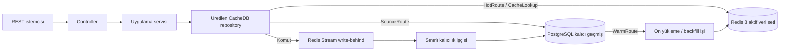

# CacheDB PostgreSQL Örneği

[English](README.md) | Türkçe

Bu proje, CacheDB'nin Redis 8 ve PostgreSQL ile nasıl kullanılacağını gösteren,
canlı ortam yaklaşımına yakın bir Spring Boot REST API örneğidir. Tasarım
bilinçli olarak açıktır: operasyonel yollar Redis'teki sınırlı aktif veri setini
kullanır, kalıcı geçmiş PostgreSQL'de tutulur, büyüyen listeler ise tam
aggregate yerine projection üzerinden okunur.

> Bu örnek, CacheDB `0.7.0` değişmez sürümünü GitHub Packages üzerinden kullanır;
> sample build'i CacheDB kaynak reposunu kendi içinde derlemez.

## Buradan Başla

| Hedefin | İlgili bölüm |
| --- | --- |
| Örneği çalıştırmak | [Hızlı Başlangıç](#hızlı-başlangıç) |
| Redis ve PostgreSQL davranışını anlamak | [Çalışma Zamanı Sözleşmesi](#çalışma-zamanı-sözleşmesi) |
| Deklaratif Java API'sini görmek | [Kod Üzerinden Akış](#kod-üzerinden-akış) |
| PostgreSQL'deki mevcut veriyi Redis'e hazırlamak | [Mevcut Veriyi Hazırlama](#mevcut-veriyi-hazırlama) |
| Cache sınırlarını belirlemek | [Kullanım Senaryosuna Göre Ayar](#kullanım-senaryosuna-göre-ayar) |
| Tüm yolları denemek | [API Kataloğu](#api-kataloğu) veya [Postman](#postman) |
| Canlı ortam geçişini hazırlamak | [Canlı Ortam Kontrol Listesi](#canlı-ortam-kontrol-listesi) |
| Başlangıç veya veri yolu sorununu çözmek | [Sorun Giderme](#sorun-giderme) |

## Bu Örnek Ne Öğretiyor?

Örnek, basit bir CRUD uygulamasından daha geniş bir alanı kapsar:

- müşteriler sipariş verir; siparişlerin çok sayıda satırı olabilir
- ürün uygunluğu katalog ve düşük stok ekranlarını besler
- gönderiler aktif, istisna, hareket ve arşiv yollarına ayrılır
- destek talepleri operasyon paneline veri sağlar
- rapor işleri ve denetim olaylarında anlık iş yükü ile kalıcı geçmiş ayrılır

Ürünün sınırı da aynı açıklıkla gösterilir:

| Sınıflandırma | Anlamı |
| --- | --- |
| **BEST** | Sınırlı bir operasyonel yol tanımla, entity veya projection verisini hazırla, ölç ve arşiv/geçmiş okumalarını PostgreSQL'de tut. |
| **ACCEPTABLE** | Redis'teki aktif veri setinin dışında kalan ve seyrek okunan veri için sınırlı bir PostgreSQL yolu kullan. |
| **ANTI-PATTERN** | CacheDB'yi şeffaf bir cache gibi görüp Redis'te bulunmayan her sorgunun otomatik SQL çalıştırmasını ve Redis'i doldurmasını bekleme. |

CacheDB, hangi ekran ve komutların öngörülebilir düşük gecikmeye ihtiyaç
duyduğunu bilen ekipler için güçlü bir çözümdür. Temel iş yükü bütün veritabanı
üzerinde sınırsız ve anlık sorgular çalıştırmak olan uygulamalar için uygun
değildir.

## Mimari



Uygulama kodu repository interface'lerine bağımlıdır. Annotation processor;
implementasyonları, codec'leri, indeksleri, projection binding'lerini ve Spring
bean'lerini derleme sırasında üretir. Entity keşfi için çalışma zamanı
reflection'ı kullanılmaz.

## Kısa Sözlük

| Terim | Bu örnekteki anlamı |
| --- | --- |
| Entity | SQL kolonlarına ve Redis namespace'ine eşlenen komut/detay modeli |
| Projection | `OrderSummary` gibi küçük ve ekrana özel okuma modeli |
| Aktif veri seti | Redis'te bilinçli olarak tutulan sınırlı veri kümesi |
| Aktif yol (`HotRoute`) | Redis'teki aktif veri setini okuyan repository metodu |
| Kaynak yolu (`SourceRoute`) | PostgreSQL'i açıkça ve sınırlı biçimde okuyan repository metodu |
| Ön yükleme (`warm/backfill`) | PostgreSQL'den Redis'e kontrollü veri hazırlama işi |
| Route coverage | Gerekli kapsamın ve pencerenin Redis'te hazır olduğunu gösteren kanıt |
| Write-behind | Redis'in kabul ettiği komutun PostgreSQL'e asenkron yazılması |
| Write receipt | Kimlik, sürüm ve kalıcılık durumunu izlemek için kullanılan komut sonucu |

## Gereksinimler

- JDK 21
- Maven 3.9+
- Docker Desktop veya uyumlu bir Docker Engine
- Hazır yük testi için PowerShell 7+
- Yalnızca GitHub Packages'tan yayımlanmış paket çekerken `read:packages`
  yetkili GitHub token'ı

Yerel araçları kontrol et:

```powershell
java -version
mvn -version
docker version
docker compose version
```

## Bağımlılık Modeli

Örnek proje CacheDB'yi Maven artifact'leri üzerinden kullanır. Sample build'i
framework kaynak kodunu kendi içinde derlemez.

```xml
<properties>
    <java.version>21</java.version>
    <cachedb.version>0.7.0</cachedb.version>
</properties>

<dependencyManagement>
    <dependencies>
        <dependency>
            <groupId>com.reactor.cachedb</groupId>
            <artifactId>cachedb-bom</artifactId>
            <version>${cachedb.version}</version>
            <type>pom</type>
            <scope>import</scope>
        </dependency>
    </dependencies>
</dependencyManagement>

<dependencies>
    <dependency>
        <groupId>com.reactor.cachedb</groupId>
        <artifactId>cachedb-spring-boot-starter-postgres</artifactId>
    </dependency>
    <dependency>
        <groupId>com.reactor.cachedb</groupId>
        <artifactId>cachedb-annotations</artifactId>
    </dependency>
    <dependency>
        <groupId>org.springframework.boot</groupId>
        <artifactId>spring-boot-starter-jdbc</artifactId>
    </dependency>
    <dependency>
        <groupId>org.postgresql</groupId>
        <artifactId>postgresql</artifactId>
        <scope>runtime</scope>
    </dependency>
</dependencies>

<build>
    <plugins>
        <plugin>
            <artifactId>maven-compiler-plugin</artifactId>
            <configuration>
                <release>${java.version}</release>
                <annotationProcessorPaths>
                    <path>
                        <groupId>com.reactor.cachedb</groupId>
                        <artifactId>cachedb-processor</artifactId>
                        <version>${cachedb.version}</version>
                    </path>
                </annotationProcessorPaths>
            </configuration>
        </plugin>
    </plugins>
</build>
```

Yönetim ekranı gerekiyorsa `cachedb-spring-boot-starter-admin` ekle. JPA veya
başka bir starter uygulama için zaten `DataSource` oluşturuyorsa
`spring-boot-starter-jdbc` bağımlılığını tekrar eklemen gerekmez. CacheDB'nin
ihtiyacı; çalışan bir `DataSource`, tek bir veritabanı starter'ı, annotations
artifact'i ve annotation processor'dır.

GitHub Packages için `pom.xml` içindeki repository kimliği ile Maven
`settings.xml` içindeki server kimliği aynı olmalıdır:

```xml
<settings>
    <servers>
        <server>
            <id>cache-database-github-packages</id>
            <username>${env.GITHUB_ACTOR}</username>
            <password>${env.GITHUB_TOKEN}</password>
        </server>
    </servers>
</settings>
```

## Hızlı Başlangıç

### 1. Geliştirme snapshot'ını kur

Değişmez `0.7.0` paketleri yayımlandıktan sonra bu adımı atlayabilirsin.

Framework ve örnek repolar aynı dizinde yan yana duruyorsa:

```powershell
mvn -f ..\cache-database\pom.xml -DskipTests install
```

Bu örneği ana CacheDB reposunun içinden çalıştırıyorsan:

```powershell
mvn -f ..\pom.xml -DskipTests install
```

### 2. Redis ve PostgreSQL'i başlat

```powershell
docker compose up -d
docker compose ps
```

Compose dosyası şu servisleri açar:

| Servis | Adres | Yerel kullanım amacı |
| --- | --- | --- |
| Redis 8.2.1 | `127.0.0.1:56379` | Aktif entity, projection, indeks, stream, lease ve telemetry verileri |
| PostgreSQL 16 | `127.0.0.1:55432` | Kalıcı doğruluk kaynağı |

### 3. API'yi demo profiliyle başlat

Yerel şema kurulumu, seed ve ön yükleme endpoint'leri, periyodik warm ve yönetim
ekranı için `demo` profili zorunludur.

```powershell
$env:SPRING_PROFILES_ACTIVE = "demo"
mvn spring-boot:run
```

Bash karşılığı:

```bash
SPRING_PROFILES_ACTIVE=demo mvn spring-boot:run
```

### 4. Hazırlık durumunu kontrol et

```powershell
Invoke-RestMethod http://127.0.0.1:8091/actuator/health/readiness
```

Durum `UP` olmadan ilerleme. Readiness; Redis, PostgreSQL ve write-behind
durumunu birlikte değerlendirir. Liveness ise yalnızca uygulama sürecinin
çalıştığını gösterir.

### 5. Kalıcı demo verisini oluştur

Seed işlemi sınırlı ve dağıtık bir iş olarak çalışır; `202 Accepted` döner. Tek
HTTP isteğini açık tutmak yerine işi durum endpoint'inden izle:

```powershell
$seed = Invoke-RestMethod -Method Post `
  -Uri "http://127.0.0.1:8091/api/demo/seed?customers=20&ordersPerCustomer=40&linesPerOrder=4"

do {
    Start-Sleep -Milliseconds 250
    $seedState = Invoke-RestMethod "http://127.0.0.1:8091/api/warm/jobs/$($seed.jobId)"
} while ($seedState.status -in @("QUEUED", "RUNNING"))

if ($seedState.status -ne "COMPLETED") {
    throw ($seedState | ConvertTo-Json -Depth 8)
}
```

`COMPLETED`, seed işinin tamamlandığını gösterir. Production geçişinde SQL
kalıcılığının sağlıklı olduğunu doğrulamak için ayrıca readiness durumunu ve
write-behind kuyruğunu izlemelisin.

Seed işlemi kalıcı demo kayıtlarını oluşturur; ancak bütün Redis route'larını
hazır kabul etmez. İlgili warm işi tamamlanıp coverage kaydı oluşmadan hızlı
erişim listesi bilinçli olarak `503 Service Unavailable` döner. Böylece boş ya
da eksik bir Redis penceresi, tam iş sonucu sanılmaz.

### 6. Müşteri sipariş projection'ını hazırla

```powershell
$warm = Invoke-RestMethod -Method Post `
  -Uri "http://127.0.0.1:8091/api/warm/orders/customer/1?limit=100&projectionOnly=true"

do {
    Start-Sleep -Milliseconds 250
    $warmState = Invoke-RestMethod "http://127.0.0.1:8091/api/warm/jobs/$($warm.jobId)"
} while ($warmState.status -in @("QUEUED", "RUNNING"))

if ($warmState.status -ne "COMPLETED") {
    throw ($warmState | ConvertTo-Json -Depth 8)
}
```

### 7. Aktif yol ile arşiv yolunu karşılaştır

```powershell
# Redis projection yolu
Invoke-RestMethod "http://127.0.0.1:8091/api/customers/1/orders?limit=10"

# Sınırlı PostgreSQL yolu
Invoke-RestMethod "http://127.0.0.1:8091/api/orders/archive?customerId=1&limit=10"
```

### 8. Operasyon araçlarını aç

- Yönetim ekranı: `http://127.0.0.1:8091/cachedb-admin`
- Güncel ayarlar: `http://127.0.0.1:8091/api/tuning`
- Periyodik warm durumu: `http://127.0.0.1:8091/api/warm/schedules`

PostgreSQL verisini silmeden yerel servisleri durdur:

```powershell
docker compose down
```

`docker compose down -v` komutunu yalnızca yerel PostgreSQL volume'unu bilinçli
olarak silmek istediğinde kullan.

## Çalışma Zamanı Sözleşmesi

| İşlem | Ana veri yolu | Veri Redis'in dışındaysa | Kalıcılık ve güvenlik kuralı |
| --- | --- | --- | --- |
| `save`, update, soft delete | Önce Redis, sonra PostgreSQL write-behind | Veri kabul politikası izin veriyorsa komut Redis'e girer | `202 Accepted`, SQL commit anlamına gelmez; işlem makbuzunu ve readiness ölçümlerini izle |
| Entity detayı | Redis entity sorgusu | Açık bir `unavailable/not-found` sonucu döner; kendiliğinden sınırsız SQL çalıştırmaz | Entity yolunu hazırla veya sınırlı source-detail yolu oluştur |
| Büyüyen liste veya panel | Redis projection | Tam route kapsamı hazır değilse `completeItems()` çağrısı `503 Service Unavailable` döner | Aynı kapsamı hazırlayan warm işini çalıştır, `COMPLETED` durumunu bekle ve geçişten önce coverage doğrula |
| Arşiv, dışa aktarma, denetim geçmişi | Sınırlı PostgreSQL source route | PostgreSQL'i doğrudan okur | Satır sınırı, deterministik sıralama, indeks ve timeout kullan |
| PostgreSQL'deki mevcut kayıt | Warm/backfill PostgreSQL'den okur ve Redis'i doldurur | Uygulama açılırken otomatik içe aktarma yapılmaz | Önce dry-run, ardından sınırlı warm ve coverage kontrolü yap |
| CacheDB dışından PostgreSQL yazısı | Önce PostgreSQL değişir | Bir değişiklik akışı yoksa Redis eski kalabilir | Outbox/CDC kullan; periyodik warm olay aktarımının yerine geçmez |

Aktif veri seti, veritabanının ikinci ve tam kopyası değildir. Redis belleğini;
entity veri yükleri, projection'lar, indeksler, stream durumu, lease kayıtları ve
operasyon metadata'sıyla birlikte hesaplamalısın.

## Kod Üzerinden Akış

### 1. Entity: kalıcı veri şekli

[`OrderEntity`](src/main/java/com/example/cachedb/sample/domain/OrderEntity.java),
SQL kolonlarını, Redis namespace'ini, bölümlenmiş indeksi ve sınırlı ilişkiyi
tanımlar:

```java
@CacheEntity(table = "sample_orders", redisNamespace = "sample-orders")
@CachePartitionedIndex(partitionBy = "customer_id", sortBy = "order_date")
public class OrderEntity {
    @CacheId(column = "order_id")
    public Long orderId;

    @CacheColumn("customer_id")
    public Long customerId;

    @CacheColumn("order_date")
    public Long orderDate;

    @CacheRelation(
            target = OrderLineEntity.class,
            mappedBy = "orderId",
            kind = CacheRelation.RelationKind.ONE_TO_MANY,
            batchLoadOnly = true,
            maxRowsPerParent = 50,
            parentBatchSize = 16,
            orderBy = "lineNumber ASC"
    )
    public List<OrderLineEntity> lines;
}
```

Veritabanındaki foreign key kalıcı ilişki bütünlüğünü korur.
`@CacheRelation` ise CacheDB'ye ilişkinin nasıl ve hangi sınırla yükleneceğini
söyler. Biri olmadan diğeri teknik olarak bulunabilir; canlı ortam modelinde
çoğunlukla ikisine de ihtiyaç vardır.

### 2. Projection: ekranın ihtiyacı olan şekil

[`OrderSummary`](src/main/java/com/example/cachedb/sample/readmodel/OrderSummary.java),
`OrderEntity`'den küçüktür ve sipariş satırı veri yüklerini içermez:

```java
@CacheProjectionRecord(
        source = OrderEntity.class,
        id = "orderId",
        name = "order-summary",
        rankedBy = {"order_date", "priority_score"},
        refresh = CacheProjectionRecord.Refresh.ASYNC
)
public record OrderSummary(
        Long orderId,
        Long customerId,
        Long orderDate,
        BigDecimal orderAmount,
        String currencyCode,
        String orderType,
        String status,
        Integer lineCount,
        Double priorityScore
) {
}
```

Komut ve seçilmiş detay için entity; liste, zaman çizelgesi, panel, top-N ve
global sıralı yol için projection kullan.

### 3. Repository: yol sözleşmesi

[`OrderRepository`](src/main/java/com/example/cachedb/sample/repository/OrderRepository.java)
yolu tanımlar; implementasyonu processor üretir:

```java
@CacheRepository(entity = OrderEntity.class)
public interface OrderRepository extends CacheDbRepository<OrderEntity, Long> {

    @HotRoute(
            value = "customer-order-timeline",
            projection = OrderSummary.class,
            pageSize = 100,
            hotWindow = 1_000,
            memoryBudgetBytes = 16_777_216L,
            coverageScopeParameter = "customerId"
    )
    @CacheRouteQuery(
            predicates = @CachePredicate(field = "customerId", parameter = "customerId"),
            orderBy = {
                    @CacheOrder(field = "orderDate", direction = CacheOrder.Direction.DESC),
                    @CacheOrder(field = "orderId", direction = CacheOrder.Direction.DESC)
            },
            windowParameter = "window"
    )
    HotWindow<OrderSummary> customerTimeline(long customerId, WindowRequest window);

    @WarmRoute(
            value = "warm-customer-order-timeline-projection",
            from = "customerTimeline",
            maxRows = 1_000,
            maxRowsParameter = "maxRows",
            coverageScopeParameter = "customerId",
            projectionsOnly = true
    )
    CacheWarmPlan warmCustomerTimelineProjection(long customerId, int maxRows);
}
```

Yol sözleşmesi; sayfa boyutunu, aktif pencereyi, bellek bütçesini, sıralamayı,
coverage kapsamını ve warm sınırını tek yerde görünür kılar.

### 4. Uygulama servisi: iş akışının yönetimi

[`CustomerApplicationService`](src/main/java/com/example/cachedb/sample/application/customer/CustomerApplicationService.java),
Redis client'ı veya generated binding sınıfı yerine interface kullanır:

```java
@Service
public final class CustomerApplicationService {
    private final CustomerRepository customers;
    private final OrderRepository orders;

    public CustomerEntity detail(long customerId, int orderPreview) {
        return SampleHotLookups.require(
                "Customer",
                customerId,
                customers.detail(customerId, orderPreview)
        );
    }

    public List<OrderSummary> orderTimeline(long customerId, int limit) {
        return orders.customerTimeline(customerId, WindowRequest.first(limit)).completeItems();
    }
}
```

Controller HTTP girdisini doğrular. Uygulama servisi kullanım senaryosunu
yönetir. Repository interface'i veri yolu sözleşmesini taşır. Generated kod;
serileştirme, indeks ve veritabanı sağlayıcısı bağlantısını üstlenir.

## Mevcut Veriyi Hazırlama

PostgreSQL'deki mevcut satırlar uygulama açılırken otomatik olarak Redis'e
aktarılmaz. Mevcut sistemden geçerken şu sırayı izle:

1. Sınırlı bir `@HotRoute` veya `@CacheLookup` tanımla.
2. Aynı yol için `@WarmRoute` ekle.
3. `dryRun=true` çalıştır ve aday satır sayısını incele.
4. Gerçek warm işini gönder ve `COMPLETED` durumuna kadar izle.
5. Route coverage ile PostgreSQL üyelik/sıralama karşılaştırmasını doğrula.
6. Trafiği kademeli aç ve PostgreSQL geri dönüş yolunu koru.

Dry-run örneği:

```powershell
Invoke-RestMethod -Method Post `
  -Uri "http://127.0.0.1:8091/api/warm/orders/customer/1?limit=100&projectionOnly=true&dryRun=true"
```

Liste ve panel için yalnızca projection hazırlamak en doğru seçimdir. Tam entity
hazırlama, yalnızca seçilmiş detay veya komut yolu bütün aktif veri yüküne ihtiyaç
duyuyorsa kullanılmalıdır.

Eski tablolarda `entity_version` değeri `NULL` veya `0` ise ilk hazırlama
sırasında başlangıç Redis sürümü kullanılır. Bu davranış yalnızca geçişi
kolaylaştırır; değişiklik akışının yerini tutmaz. Geçişten sonra PostgreSQL'e
dışarıdan yazan her uygulama sürümü düzenli artırmalı ve değişikliği outbox/CDC
ile yayımlamalıdır. Aksi durumda bir sonraki sınırlı uzlaştırma çevrimine kadar
oluşacak gecikme bilinçli olarak kabul edilmelidir.

### Periyodik warm ve uzlaştırma

[`SampleScheduledWarmPlans`](src/main/java/com/example/cachedb/sample/config/SampleScheduledWarmPlans.java),
90 günlük sipariş penceresini deklaratif olarak tanımlar. Redis lease sayesinde
bir döngüyü yalnızca bir pod çalıştırır; diğer pod'lar güvenli biçimde bekler
veya döngüyü atlar. Uzlaştırma, policy kapsamından çıkan kayıtları temizler.

```java
@CacheScheduledWarm(
        name = "sample-active-order-window",
        fixedDelayString = "${sample.scheduled-warm.orders.fixed-delay:PT15M}",
        lockAtMostForString = "${sample.scheduled-warm.orders.lock-at-most-for:PT2M}",
        lockWaitTimeoutString = "${sample.scheduled-warm.orders.lock-wait-timeout:PT20S}",
        minimumIntervalString = "${sample.scheduled-warm.orders.minimum-interval:PT15M}",
        reconcileHotSet = true
)
public CacheWarmPlan activeOrderWindow() {
    long cutoff = Instant.now().minus(Duration.ofDays(90)).getEpochSecond();
    return orders.warmActiveWindow(cutoff, orderWarmMaxRows);
}
```

Periyodik warm seçilen aktif pencereyi korur. CacheDB üzerinden gelen yeni
yazılar normal komut yoluyla hemen işlenir; bir sonraki zamanlanmış döngüyü
beklemez.

Annotation processor metot imzasını derleme sırasında doğrular ve tipli bir
Spring task adapter'ı üretir. Runtime, annotation eklenen metotları taramaz ve
reflection ile çağırmaz.

## Kullanım Senaryosuna Göre Ayar

Ayar kararına tablo boyutundan değil, ölçülmüş yol ihtiyacından başla.

| Senaryo | Aktif veri politikası | Okuma modeli | Başlangıç sınırı | Aktif setin dışında |
| --- | --- | --- | --- | --- |
| Müşteri sipariş zaman çizelgesi | Son 90 gün **veya** aktif sipariş durumları | Müşteri başına `OrderSummary` | Sayfa `100`, pencere `1.000`, yol bütçesi `16 MiB` | Sınırlı `archive` source route |
| Ürün kataloğu | Aktif ürünler **veya** stokta/düşük stokta olanlar | `ProductAvailability` | Entity sınırı `25.000`, sayfa `100` | Pasif ürün source route'u |
| Destek operasyonu | Son 30 günde güncellenen **veya** `OPEN/PENDING/ESCALATED` kayıtlar | Küçük satırlar için entity | Entity sınırı `50.000`, sayfa `50` | Gerektiğinde açık ticket-history SQL yolu |
| Lojistik kontrol paneli | Son 14 günde güncellenen **veya** aktif/istisna durumları | `ShipmentSummary` | Entity sınırı `150.000`, yol penceresi `2.000-10.000` | Teslim edilmiş gönderi source route'u |
| Rapor çalıştırma | `QUEUED/RUNNING/FAILED` veya son 24 saat | Küçük rapor işi entity'si | Entity sınırı `5.000`, sayfa `50` | Tamamlanan rapor geçmişi PostgreSQL'de |
| Güvenlik denetimi | Son 24 saatteki önemli olaylar | Küçük ve sınırlı entity listesi | Entity sınırı `2.000`, read admission kapalı | Tam denetim arşivi PostgreSQL'de |

Örnek, çözümlenmiş çalışma zamanı ayarlarını API üzerinden gösterir:

```powershell
Invoke-RestMethod http://127.0.0.1:8091/api/tuning
Invoke-RestMethod http://127.0.0.1:8091/api/tuning/profiles
```

[`SampleCacheDbTuningConfig`](src/main/java/com/example/cachedb/sample/config/SampleCacheDbTuningConfig.java)
içindeki temel kontroller:

| Kontrol | Örnek değer | Neden var? |
| --- | ---: | --- |
| `maxEntityQueryLimit` | `250` | Geniş entity materialization işlemini durdurur |
| `maxProjectionQueryLimit` | `1.000` | Küçük projection satırları için daha geniş pencereye izin verir |
| `maxQueryLoadRows` | `1.000` | Kayıtlı source yüklemeyi sınırlar |
| `queryTimeoutSeconds` | `15` | Source okumaya zaman sınırı koyar |
| `workerThreads` | `2` | Eş zamanlı SQL flush baskısını sınırlar |
| `batchSize` / `maxFlushBatchSize` | `128` | Sınırsız batch oluşturmadan SQL round-trip sayısını azaltır |
| Redis uyarı / kritik eşikleri | `%75` / `%88` | Redis maxmemory değerine ulaşmadan backpressure uygular |
| Beklenen eviction policy | `noeviction` | Redis'in koordinasyon veya yazma durumunu sessizce atmasını engeller |

Bu değerleri doğrudan canlı ortama kopyalama. Serileştirilmiş veri yükü boyutunu,
projection/indeks maliyetini, en yüksek eş zamanlı yol trafiğini, SQL flush
gecikmesini ve yeniden hazırlama/failover sırasında gereken Redis boşluğunu ölç.

## API Kataloğu

| Alan | Örnek endpoint'ler | Veri yolu |
| --- | --- | --- |
| Sağlık ve operasyon | `GET /actuator/health/readiness`, `GET /api/tuning`, `GET /api/warm/schedules` | Çalışma zamanı telemetry'si |
| Demo hazırlığı | `POST /api/demo/seed`, `GET /api/warm/jobs/{jobId}` | Dağıtık arka plan işleri |
| Müşteri | `POST /api/customers`, `GET /api/customers/{id}`, `GET /api/customers/{id}/orders` | Komut, entity detayı, projection listesi |
| Sipariş komutları | `POST /api/orders`, `PATCH /api/orders/{id}/status`, `DELETE /api/orders/{id}` | Redis öncelikli write-behind komutları |
| Sipariş okumaları | `GET /api/orders/{id}`, `GET /api/orders/high-value`, `GET /api/orders/archive` | Entity, ranked projection, PostgreSQL source route |
| Ürün | `GET /api/products/active`, `GET /api/products/low-stock`, `PATCH /api/products/{id}/stock` | Projection okumaları ve komut |
| Gönderi | `GET /api/shipments/active`, `GET /api/shipments/exceptions`, `GET /api/shipments/archive` | Projection ve PostgreSQL source route'ları |
| Destek | `GET /api/tickets/open`, `POST /api/tickets`, `PATCH /api/tickets/{id}/status` | Sınırlı entity okuması ve komutlar |
| Raporlama | `GET /api/reports/jobs/live`, `GET /api/reports/audit/security`, `GET /api/reports/audit/archive` | Aktif kayıtlar ve kalıcı arşiv |
| Paneller | `GET /api/dashboard/commerce`, `GET /api/dashboard/operations` | Ekrana göre şekillendirilmiş Redis verisi |
| Redis'e hazırlama | `POST /api/warm/customers/active`, `/orders/customer/{id}`, `/orders/{id}/lines`, `/orders/high-value`, `/orders/highlighted`, `/products/active`, `/products/low-stock`, `/tickets/open`, `/shipments/active`, `/shipments/customer/{id}`, `/shipments/exceptions`, `/shipments/{id}/events`, `/reports/live`, `/reports/type/{type}`, `/audit/security` | Sınırlı PostgreSQL-Redis işleri; her gönderimden sonra `/api/warm/jobs/{jobId}` durumunu izle |

İstek sınırları doğrulanır. Sınırı aşan değerler sessizce küçültülmek yerine
`400 Bad Request` döner. Kuyruk doluluğu `429 Too Many Requests`; optimistic
conflict ve henüz kalıcılaşmamış ana kayıt ise `409 Conflict` üretir.

## Postman

Şu koleksiyonu içe aktar:

```text
postman/cache-database-postgresql-sample.postman_collection.json
```

Klasörleri şu sırayla çalıştır:

1. Readiness kontrolünü çalıştır, demo seed işini gönder ve `Latest Background
   Job Status` isteği `COMPLETED` gösterene kadar tekrarla.
2. Her iş alanı klasöründe hızlı erişim listesinden önce ilgili `Warm ...`
   isteğini çalıştır.
3. Her `202 Accepted` yanıtından sonra son iş `COMPLETED` olana kadar durum
   isteğini tekrarla.
4. Hızlı erişim route'unu çağır; klasörde karşılığı varsa sınırlı source/arşiv
   route'u ile sonucu karşılaştır.
5. Dashboard klasörünü, kullandığı bütün alt route'lar hazırlandıktan sonra çalıştır.
6. Pencere veya pool değerini değiştirmeden önce tuning ve periyodik warm
   durumunu incele.

## Yük Testi

Seed ve warm tamamlandıktan sonra:

```powershell
powershell -ExecutionPolicy Bypass -File .\scripts\run-load-test.ps1 `
  -RouteProfile hot-timeline `
  -Concurrency 8 `
  -DurationSeconds 20 `
  -SeedCustomers 20 `
  -OrdersPerCustomer 40 `
  -WarmCustomers 20 `
  -WarmLimit 100 `
  -MaxP95Millis 250
```

Bu komut yerel bir regresyon kapısıdır; production kapasite sonucu değildir.
Production ölçümü gerçek Redis/PostgreSQL gecikmesi, Kubernetes kaynak
sınırları, gerçek payload ve beklenen eş zamanlılıkla yapılmalıdır.

## PostgreSQL Canlı Ortam Notları

- Her source route predicate'i ve deterministik sıralama son eki için uygun
  indeks oluştur.
- Tüm pod'ların toplamını düşünerek HikariCP bağlantı sayısını PostgreSQL
  bütçesinin altında tut.
- Write-behind batch boyutunu WAL baskısı ve lock süresine göre ayarla.
- Warm, arşiv ve geçiş sorgularında statement timeout kullan.
- Aynı tablolara başka uygulamalar da yazıyorsa outbox/CDC ekle.
- Yedekleme, geri yükleme, Redis kaybı/yeniden hazırlama ve uygulamanın geri dönüş yollarını
  kanıtla.
- Operasyonel yol Redis'ten çalışsa bile kalıcı doğruluk kaynağının PostgreSQL
  olduğunu koru.

## Canlı Ortam Kontrol Listesi

- [ ] Her operasyonel endpoint; komut, aktif entity, projection veya source
  route olarak sınıflandırıldı.
- [ ] Her aktif yolun sayfa sınırı, aktif penceresi, bellek bütçesi, sıralaması
  ve coverage kapsamı tanımlandı.
- [ ] İlişki yoğun ve global sıralı ekranlar projection kullanıyor.
- [ ] Warm/backfill sınırlı, kaldığı yerden devam edebilir, izlenebilir ve Redis
  kaybından sonra test edilmiş durumda.
- [ ] Source route'ların uygun indeksleri, timeout ve maksimum satır sınırı var.
- [ ] Çağıran servisler `202 Accepted` kalıcılık anlamını biliyor.
- [ ] Redis için açık `maxmemory`, `noeviction`, alarm ve kapasite boşluğu var.
- [ ] PostgreSQL ve HikariCP bağlantı bütçesi pod başına ve toplam replica sayısı
  için hesaplandı.
- [ ] Çok pod'lu periyodik warm ve yarım kalan işin başka pod tarafından alınması
  test edildi.
- [ ] CacheDB dışındaki veritabanı yazıları outbox/CDC veya açık bir uzlaştırma
  kararıyla kapsandı.
- [ ] Yönetim endpoint'leri kapalı veya iç gateway arkasında korunuyor.
- [ ] Geçiş öncesi veri eşitliği, gecikme, canary, geri dönüş ve recovery kanıtı
  kaydedildi.

## Sorun Giderme

| Belirti | Olası neden | Çözüm |
| --- | --- | --- |
| `/api/demo/seed` veya `/api/warm/**` için `404` | Uygulama `demo` profili olmadan açıldı | `SPRING_PROFILES_ACTIVE=demo` tanımlayıp yeniden başlat |
| Maven `401 Unauthorized` döndürüyor | GitHub Packages kimlik bilgisi yok veya server kimlikleri farklı | `GITHUB_ACTOR`, `read:packages` token'ı ve aynı server kimliğini tanımla |
| `0.7.0` çözümlenemiyor | Paket kimlik bilgisi yok, server kimlikleri farklı veya yayın tamamlanmadı | `v0.7.0` paketini doğrula, `read:packages` token'ı tanımla ve aynı Maven server kimliğini kullan |
| Aktif route `503` döndürüyor, arşiv route'u satır getiriyor | Redis route'u hazırlanmadı, coverage süresi doldu veya kapsam farklı | Dry-run yap, aynı route/scope'u hazırla, `COMPLETED` durumunu bekle ve coverage kaydını incele |
| Detay yolu verinin hazır olmadığını söylüyor | Entity payload'ı aktif setin dışında | O detay kapsamı için entity warm et veya sınırlı source-detail yolu ekle |
| Ana kaydı yazdıktan sonra `409 Conflict` | Ana kayıt henüz kalıcı değil veya optimistic version değişti | `Retry-After` değerine uy, write-behind durumunu kontrol et, idempotent retry yap |
| `429 Too Many Requests` | Sınırlı iş kuyruğu veya backpressure koruması devrede | Üretim hızını düşür, Redis ve write-behind telemetry'sini incele |
| Readiness `DOWN` | Redis, PostgreSQL, dead-letter, recovery veya backlog koşulu başarısız | Readiness ayrıntısını ve logları incele; trafiği henüz yönlendirme |
| Redis bellek uyarısı veriyor | Aktif set, projection/indeks maliyeti veya backlog bütçeyi aştı | Yeni admission'ı yavaşlat, keyspace'i ölç, pencereleri küçült veya kapasite ekle |

## İlgili Dokümanlar

- [Ana CacheDB README](https://github.com/esasmer-dou/cache-database/blob/main/tr/README.md)
- [Deklaratif repository kullanımı](https://github.com/esasmer-dou/cache-database/blob/main/tr/docs/deklaratif-repositoryler.md)
- [Başlangıç rehberi](https://github.com/esasmer-dou/cache-database/blob/main/tr/docs/getting-started.md)
- [Periyodik warm ve uzlaştırma](https://github.com/esasmer-dou/cache-database/blob/main/tr/docs/periodik-warm.md)
- [Production tuning](https://github.com/esasmer-dou/cache-database/blob/main/tr/docs/production-tuning-rehberi.md)
- [Kullanım senaryosu örnekleri](https://github.com/esasmer-dou/cache-database/blob/main/tr/docs/use-case-examples.md)
- [Veritabanı provider SPI](https://github.com/esasmer-dou/cache-database/blob/main/tr/docs/veritabani-provider-spi.md)
- [Production reçeteleri](https://github.com/esasmer-dou/cache-database/blob/main/tr/docs/production-recipes.md)
